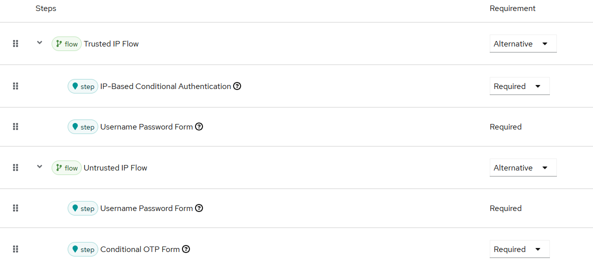

# Keycloak IP-Based Authenticator Deployment Guide

## Building the SPI

1. Ensure you have Java 11+ and Maven installed
2. Update the Keycloak version in `pom.xml` to match your Keycloak installation
3. Build the project:
   ```bash
   mvn clean package
   ```
4. The JAR file will be created in `target/keycloak-ip-authenticator-version.jar`

## Deployment

### For Keycloak Quarkus (v17+):
Copy the JAR to:
```bash
cp target/keycloak-ip-authenticator-1.0.0.jar $KEYCLOAK_HOME/providers/
```

Then rebuild Keycloak:
```bash
$KEYCLOAK_HOME/bin/kc.sh build
```
## Running Keycloak in Development Mode

Before configuring the authenticator, start Keycloak in development mode.  
This allows you to quickly test changes without additional setup like HTTPS or database configuration:

```bash
$KEYCLOAK_HOME/bin/kc.sh start-dev
```


## Configuration in Keycloak Admin Console

### Step 1: Create a New Authentication Flow

1. Login to Keycloak Admin Console
2. Select your realm
3. Go to **Authentication** → **Flows**
4. Click **Create flow**
5. Name it "IP-Based Browser Flow" and set type as "Basic flow"

### Step 2: Configure the Flow

1. In your new flow, click **Add execution**
2. Search for "IP-Based Conditional Authentication" and add it
3. Set it as **REQUIRED**
4. Click the gear icon to configure:
   - **Trusted IP Addresses**: Enter comma-separated IPs or CIDR ranges
     - Example: `192.168.1.0/24, 10.0.0.1, 172.16.0.0/16`
   - **Check Behind Proxy**: Enable if Keycloak is behind a reverse proxy
   - **Proxy Header Name**: Set to your proxy's forwarding header (e.g., X-Forwarded-For)

### Step 3: Add Conditional OTP

1. Click **Add execution** again
2. Add "Conditional OTP Form" or your preferred OTP authenticator
3. Set it as **CONDITIONAL** or **REQUIRED** based on your needs
4. Configure the OTP settings as needed

### Step 4: Add Username/Password Forms

1. Add **Username Password Form** execution
2. Set as **REQUIRED**
3. Arrange the executions in this order:
   - IP-Based Conditional Authentication (REQUIRED)
   - Username Password Form (REQUIRED)  
   - OTP Form (CONDITIONAL/ALTERNATIVE)

### Step 5: Bind the Flow

1. Go to **Authentication** → **Bindings**
2. Set **Browser Flow** to your new "IP-Based Browser Flow"
3. Save the changes

## Creating a Conditional Sub-Flow (Advanced)

In Keycloak, executions added at the same level of a flow are triggered together once the client request hits the flow entrypoint.  
To create a functional IP-based conditional authentication flow, you need to organize your executions into **sub-flows** rather than keeping everything at the same layer.

### Example: Trusted vs Untrusted IPs

1. In your main flow ("IP-Based Browser Flow"), click **Add flow**
2. Create a sub-flow named **Trusted IP Flow** (ALTERNATIVE)
   - Inside this sub-flow, add:
     - **IP-Based Conditional Authentication** (REQUIRED)  
     - **Username Password Form** (REQUIRED)  
   - This ensures that if the client’s IP is in the trusted list, only username/password is required.
3. Back in the main flow, create another sub-flow named **Untrusted IP Flow** (ALTERNATIVE)
   - Inside this sub-flow, add:
     - **IP-Based Conditional Authentication** (REQUIRED)  
     - **Username Password Form** (REQUIRED)  
     - **OTP Form** (REQUIRED or CONDITIONAL, depending on your needs)  
   - This ensures that if the client’s IP is not in the trusted list, the user must provide both username/password and OTP.
4. Arrange the two sub-flows under your main flow so that Keycloak evaluates the IP condition and routes users accordingly.

> With this structure, only one sub-flow will be executed based on the IP address check, avoiding all executions being triggered at the same time.




## Testing

### Test Trusted IP:
1. Access Keycloak from a trusted IP address
2. You should only see username/password prompt

### Test Untrusted IP:
1. Access from an IP not in the trusted list
2. After username/password, you should be prompted for OTP

### Test with a Configured User

For testing, you can create a user in your realm without any **Required Actions** set.  
If you assign the **Configure OTP** required action to the user, then during authentication Keycloak will still prompt for OTP even if the client’s IP is in the trusted whitelist.  

This happens because required actions are enforced independently of the conditional IP-based authenticator.


### Debug Logging:
Enable debug logging to troubleshoot:
```bash
/subsystem=logging/logger=org.example.keycloak.authenticator:add(level=DEBUG)
```

### Security Considerations

1. **IP Spoofing**: Be cautious when using proxy headers as they can be spoofed
2. **HTTPS Only**: Always use HTTPS to prevent man-in-the-middle attacks
3. **Regular Updates**: Keep the trusted IP list updated
4. **Audit Logging**: Monitor authentication attempts from both trusted and untrusted IPs

### Example Nginx Configuration (if using proxy)

```nginx
location / {
    proxy_pass http://keycloak:8080;
    proxy_set_header Host $host;
    proxy_set_header X-Real-IP $remote_addr;
    proxy_set_header X-Forwarded-For $proxy_add_x_forwarded_for;
    proxy_set_header X-Forwarded-Proto $scheme;
}
```

### IPv6 Support

To add IPv6 support, extend the `isIPInCIDR` method to handle IPv6 addresses using `InetAddress` class for more robust IP handling.

## Running the Test Suite

### Run All Tests
```bash
mvn test
```

### Run Specific Test Class
```bash
mvn test -Dtest=IPBasedAuthenticatorTest
```

### Run with Coverage Report
```bash
mvn clean test jacoco:report
```
Coverage report will be available at `target/site/jacoco/index.html`

### Run Tests in Parallel
```bash
mvn test -DforkCount=4 -DreuseForks=true
```

### Performance Tests
```bash
mvn test -Dtest=*PerformanceTests
```

## Code Coverage Goals

The project is configured with JaCoCo to enforce:
- **Line Coverage**: Minimum 80%
- **Branch Coverage**: Minimum 75%

## Continuous Integration

### GitHub Actions Example
```yaml
name: Tests
on: [push, pull_request]
jobs:
  test:
    runs-on: ubuntu-latest
    steps:
      - uses: actions/checkout@v3
      - uses: actions/setup-java@v3
        with:
          java-version: '11'
      - run: mvn clean test
      - run: mvn jacoco:report
      - uses: codecov/codecov-action@v3
```

### Jenkins Pipeline Example
```groovy
pipeline {
    agent any
    stages {
        stage('Test') {
            steps {
                sh 'mvn clean test'
            }
        }
        stage('Coverage') {
            steps {
                sh 'mvn jacoco:report'
                publishHTML(target: [
                    reportDir: 'target/site/jacoco',
                    reportFiles: 'index.html',
                    reportName: 'Code Coverage'
                ])
            }
        }
    }
}
```

## Test Data

### Sample Trusted IP Configurations
```
// Single CIDR range
"192.168.1.0/24"

// Multiple ranges
"192.168.1.0/24, 10.0.0.0/8, 172.16.0.0/12"

// Mix of CIDR and exact IPs
"192.168.1.0/24, 8.8.8.8, 1.1.1.1, 10.0.0.0/16"

// All IPs trusted (testing only!)
"0.0.0.0/0"
```

### Sample Proxy Headers
```
X-Forwarded-For: 203.0.113.42, 198.51.100.1, 10.0.0.1
X-Real-IP: 203.0.113.42
CF-Connecting-IP: 203.0.113.42
Forwarded: for=192.0.2.43, for=198.51.100.17
```

## Debugging Tests

### Run Single Test Method
```bash
mvn test -Dtest=IPBasedAuthenticatorTest#testTrustedIPAuthentication
```

## Best Practices

1. **Use Descriptive Names**: Test methods should clearly describe what they test
2. **Arrange-Act-Assert**: Structure tests with clear setup, execution, and verification
3. **One Assertion Per Test**: Keep tests focused on single behaviors
4. **Mock External Dependencies**: Isolate the unit under test
5. **Use Parameterized Tests**: For testing multiple similar scenarios
6. **Clean Up Resources**: Use `@AfterEach` for cleanup
7. **Test Edge Cases**: Include boundary conditions and error scenarios

## Performance Benchmarks

Expected performance metrics:
- Single authentication: < 1ms
- 1000 concurrent authentications: < 1 second
- Large IP list (100 CIDR ranges): < 100ms for 1000 checks

## Contributing

When adding new features:
1. Write tests first (TDD approach)
2. Ensure all existing tests pass
3. Add integration tests for complex features
4. Update this documentation
5. Maintain code coverage above thresholds